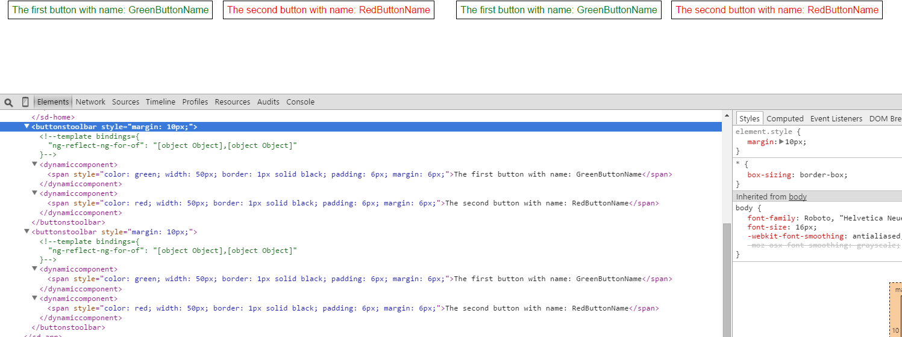

# angular2-dynamic-component

An implementation of dynamic component wrapper at Angular2 (2.0.0 compatible).

## Installation

First you need to install the npm module:
```sh
npm install angular2-dynamic-component --save
```

## Use case #1

**app.html**
```html
<ButtonsToolbar></ButtonsToolbar><br>
<ButtonsToolbar></ButtonsToolbar>
```

```html
<template ngFor let-button [ngForOf]="buttons">
  <ButtonsToolbarPlaceholder [componentType]="button.type" [buttonName]="button.name">
  </ButtonsToolbarPlaceholder>
</template>
```

```typescript
export interface ButtonType {
    name:string;
    type:{new ():IButton};
}

@Component({
    selector: 'ButtonsToolbar',
    template: require('./ButtonsToolbar.html')
})
export class ButtonsToolbar {

    buttons:Array<ButtonType> = [
        {
            name: 'GreenButtonName',
            type: GreenButton
        },
        {
            name: 'RedButtonName',
            type: RedButton
        }
    ];
}
```

```typescript
import {DynamicComponent, DynamicComponentMetadata} from 'angular2-dynamic-component/index';

class ButtonsToolbarComponent extends DynamicComponentMetadata {

    constructor(public selector:string = 'ButtonsToolbarPlaceholder') {
        super();
    }
}

@Component(new ButtonsToolbarComponent())
export class ButtonsToolbarPlaceholder extends DynamicComponent<IButton> implements IButton {

    @Input() buttonName:string;
    @Input() componentType:{new ():IButton};
    
    protected destroyWrapper:boolean;

    constructor(...) {
        super(element, viewContainer, compiler, http);
        
        this.destroyWrapper = true;  // remove placeholder after,  because the component is not reset, and the data are not changed
    }
}
```

```typescript
export interface IButton {
    buttonName:string;
}

@Component({
    selector: 'GreenButton',
    template: '<span style="color: green; width: 50px; border: 1px solid black; padding: 6px; margin: 6px;">The first button with name: {{ buttonName }}</span>',
})
export class GreenButton implements IButton {

    @Input() public buttonName:string;
}

@Component({
    selector: 'RedButton',
    template: '<span style="color: red; width: 50px; border: 1px solid black; padding: 6px; margin: 6px;">The second button with name: {{ buttonName }}</span>',
})
export class RedButton implements IButton {
    @Input() public buttonName:string;
}
```



## Use case #2. Using the "componentTemplate" attribute
**app.ts**
```typescript
import {DynamicComponentModule} from 'angular2-dynamic-component/index';

@NgModule({
    imports: [DynamicComponentModule]
})
...

class DynamicContext {
  value:string;

  onChange() {
    console.log(this.value)
  }
}

@Component(...)
class App {
    private componentTemplate:string = '<input type="text" [(ngModel)]="value" (ngModelChange)="onChange($event)"/>';
    private extraModules = [FormsModule];
    private context = new DynamicContext();
}
```

**app.html**
```html
<DynamicComponent [componentTemplate]="componentTemplate" 
                  [componentInputData]="context"
                  [componentModules]="extraModules">
</DynamicComponent>
```

## Use case #3. Using the "componentTemplateUrl" attribute

The main feature is the support of [http 301](https://en.wikipedia.org/wiki/HTTP_301) and [http 302](https://en.wikipedia.org/wiki/HTTP_302) statuses.

**app.ts**
```typescript
import {DynamicComponentModule} from 'angular2-dynamic-component/index';

@NgModule({
    imports: [DynamicComponentModule]
})
```

**app.html**
```html
<DynamicComponent [componentTemplateUrl]="'http://www.yandex.ru'">
</DynamicComponent>
```

## Use case #4. Using the "componentModules" and "componentInputData" attribute

**app.ts**
```typescript
import {DynamicComponentModule} from 'angular2-dynamic-component/index';

@NgModule({
    imports: [DynamicComponentModule]
})
...

import {IComponentInputData} from 'angular2-dynamic-component/index';

@Component({
	...
	template: `
    <DynamicComponent [componentModules]="extraModules"
                      [componentInputData]="inputData"
                      [componentTemplate]="template"></DynamicComponent>
  `
})
export class App {

	template: string = 'Empty current date';
	extraModules:Array<any> = [InnerModule];
	inputData: IComponentInputData = {currentDate: new Date()};

	ngOnInit() {
		setTimeout(() => {
			this.template = 'Current date is: {{ currentDate | date }}<br>Custom pipe value is: {{ "input value" | myPipe }}';
		}, 1000);
	}
}
```

**InnerModule.ts**
```typescript
import {NgModule, Pipe} from '@angular/core';

@Pipe({
	name: 'myPipe',
})
class MyPipe {
	transform(value: any): string {
		return 'transformed value';
	}
}

@NgModule({
	declarations: [MyPipe],
	exports: [
		MyPipe
	]
})
export class InnerModule {
}
```

## Publish

```sh
npm run deploy
```

## License

Licensed under MIT.